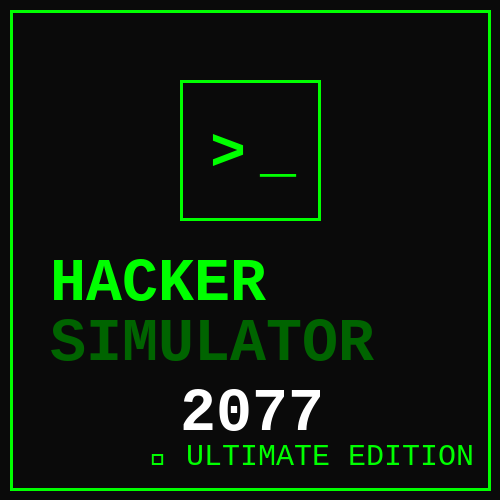
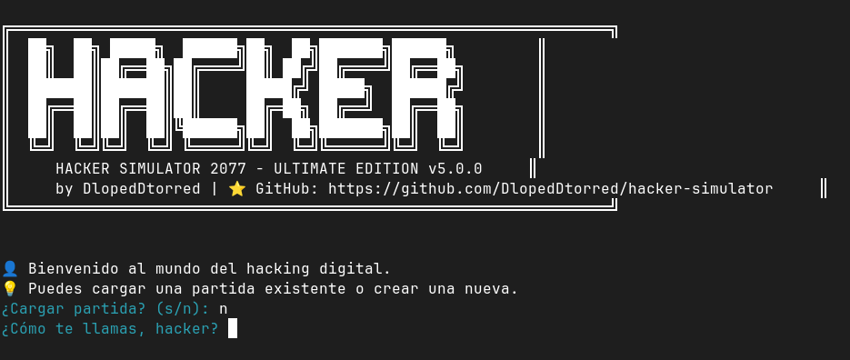
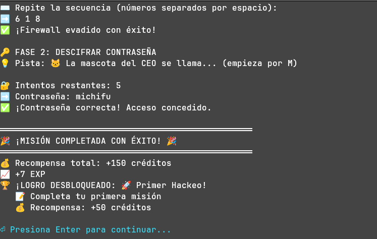

# 🖥️ HACKER SIMULATOR 2077 - ULTIMATE EDITION

[](https://python.org)
[](LICENSE)
[](https://github.com/DlopedDtorred/hacker-simulator)
[](https://github.com/DlopedDtorred/hacker-simulator/issues)
[](CONTRIBUTING.md)
[](https://github.com/DlopedDtorred/hacker-simulator/graphs/contributors)

<p align="center">
  
</p>

## 🎯 ¿Qué es esto?

**Hacker Simulator 2077** es un juego de hacking en terminal donde encarnas a un hacker ético. Tu misión es infiltrarte en servidores, evadir firewalls, descifrar contraseñas y convertirte en el mejor hacker del submundo digital.

### 🎮 Características Principales

- 🔐 **15 servidores únicos** con diferentes dificultades
- 🧩 **4 mini-juegos**: Firewall, Criptografía, SQL Injection, Puzzles
- 🏆 **20+ logros** con recompensas
- 📈 **Sistema de rachas** con bonificaciones
- 🛒 **8 herramientas** para comprar en la tienda
- 📅 **Misiones diarias** con recompensa doble
- 💾 **Sistema de guardado** en JSON
- 🎨 **4 temas visuales** (Matrix, Cyberpunk, Classic, Dark)
- 🏆 **Ranking de hackers**
- 📖 **Guía de usuario integrada**
- 🔊 **Sonidos** (opcional)
- 🔓 **100% Open Source** (MIT License)

## 🚀 Instalación

### Requisitos
- Python 3.8+
- pip (gestor de paquetes)

### Pasos

```bash
# 1. Clona el repositorio
git clone https://github.com/DlopedDtorred/hacker-simulator.git
cd hacker-simulator

# 2. Crea y activa un entorno virtual (opcional pero recomendado)
python -m venv venv
source venv/bin/activate  # En Windows: venv\Scripts\activate

# 3. Instala las dependencias
pip install colorama

# 4. Ejecuta el juego
python cyberdex.py

```

# 🎮 Guía Rápida
Comandos Básicos
Comando	Acción
1	Hackear servidor
2	Misión diaria
3	Entrenar
4	Tienda
5	Estadísticas
6	Ranking
7	Configuración
8	Guardar partida
9	Guía de usuario
0	Salir
Consejos para Principiantes
Lee las pistas - Cada servidor tiene una pista que te ayuda a descifrar la contraseña

Compra herramientas - La tienda tiene herramientas que facilitan las misiones

Mantén la racha - Las misiones consecutivas dan bonificaciones extra

Misiones diarias - Dan el doble de recompensa, ¡no las desperdicies!

Logros - Desbloquea logros para obtener créditos extra
# 🛠️ Herramientas Disponibles
Herramienta	Precio	Descripción
🔧 Escáner Avanzado	100	+2 intentos en contraseñas
🛡️ Firewall Bypass	200	Firewalls -1 dificultad
🔑 Crypto Key	300	Revela pistas extra
⚡ Quantum Decryptor	500	Descifra mensajes automáticamente
🔬 Nano Analyzer	700	Analiza servidores en profundidad
🎯 Matrix Key	1000	Acceso a servidores de élite
⏳ Chrono Analyzer	1500	Predice contraseñas
☯️ Omega Key	2500	Acceso total al sistema Omega
# 🤝 ¿Cómo Colaborar?
¡Las contribuciones son bienvenidas! Revisa nuestra guía de contribución.

Áreas para contribuir
Servidores - Añadir nuevos servidores con pistas creativas

Mini-juegos - Crear nuevos mini-juegos para entrenamiento

Herramientas - Añadir herramientas a la tienda

Logros - Expandir el sistema de logros

Documentación - Mejorar el README y la guía

Traducciones - Traducir el juego a otros idiomas

Sonidos - Añadir efectos de sonido

Issues recomendados para empezar
🟢 [good first issue] Añadir un nuevo servidor

🟢 [good first issue] Añadir un nuevo mini-juego

🟡 [medium] Mejorar el sistema de guardado

🔴 [hard] Modo multijugador local

# 📸 Capturas de Pantalla
<p align="center">   </p>
Próximamente: capturas de pantalla

# 📚 Documentación
Guía de Usuario

Guía de Contribución

API de Desarrollador

# 🎯 Roadmap
v5.0 (Actual)
✅ 15 servidores

✅ 20+ logros

✅ Sistema de guardado

✅ Misiones diarias

✅ 4 temas visuales

v6.0 (Próximo)
⬜ Modo multijugador local

⬜ Más mini-juegos

⬜ Sistema de clanes

⬜ Eventos especiales

⬜ Versión web (JavaScript)

# 📄 Licencia
Este proyecto está bajo la Licencia MIT - ver el archivo LICENSE para más detalles.

# 🙏 Agradecimientos
Comunidad Open Source

Todos los contribuidores

Usuarios que reportan bugs y sugieren mejoras

# ⭐ Apóyanos
Si te gusta el proyecto, ¡dale una estrella en GitHub!

<p align="center"> <a href="https://github.com/DlopedDtorred/hacker-simulator">  </a> </p>
¡Feliz hacking! 🚀
